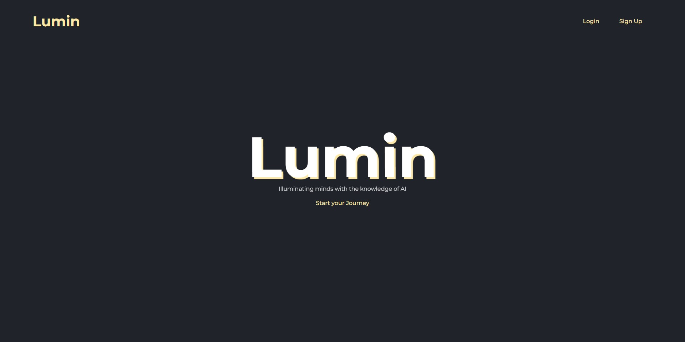

# Lumin

**Welcome to Lumin,** a student project aimed at delving into the world of web technologies while focusing on learning and innovation. In this project, I am leveraging OpenAI's API to create interactive tools and games that enhance the learning experience. Let's take a closer look:

## Project Overview

Lumin serves as an experimental platform where I am actively engaging with web development and OpenAI's capabilities to foster an environment of continuous learning and growth. Below are some highlights of what Lumin offers:

## Notable Features

- **Personalized Quizzes**: Lumin generates personalized quizzes tailored to individual preferences and areas of interest, making learning both engaging and effective.

- **Dynamic Flashcards**: The project includes an interactive flashcard game designed to reinforce learning through dynamic interactions and visual cues.

- **Cognitive Crosswords**: A crossword game has been developed to stimulate cognitive thinking, expand vocabulary, and promote active learning.

## Getting Started

For those interested in exploring Lumin:

1. **Repository Clone**: To get started, clone the repository using the command `git clone https://github.com/tib-source/lumin.git`.

2. **Dependencies Installation**: Run `npm install` in both the client and server file to install the necessary dependencies and libraries.

3. **API Integration**: Obtain your OpenAI API key and insert it in the `./server/.env` file as follows: `OPENAI_API_KEY=your_api_key`.

4. **Server Launch**: Launch the development server using `cd server npm start`.

5. **Client Launch**: Launch the front end server by opening another terminal and using `cd client npm start`.

5. **Access Lumin**: Open your browser and navigate to `http://localhost:3000` to explore Lumin's features.

## Future Plans

Lumin's potential goes beyond its current state. Future enhancements are planned to elevate the learning experience:

- **Expanding Game Library**: Additional interactive games are in development to provide a diversified learning journey.

- **Essay Analysis**: Considerations are being made to implement an essay analysis feature to provide valuable insights for skill improvement.

- **Gamification**: Gamifying the platform aims to enhance user engagement and motivation.

## Contributing

Collaboration is welcomed! If you'd like to contribute to Lumin's development, please review our [contribution guidelines](CONTRIBUTING.md).

## License

Lumin is released under the [MIT License](LICENSE) to promote sharing and learning.

---

*Note: Lumin is a personal student project and is not officially affiliated with OpenAI.*
